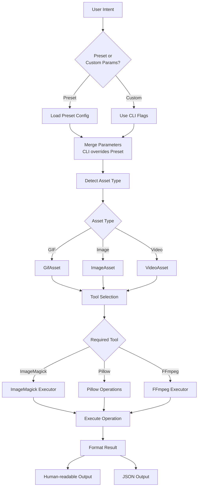
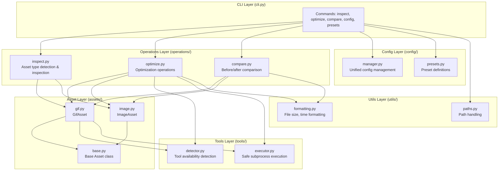
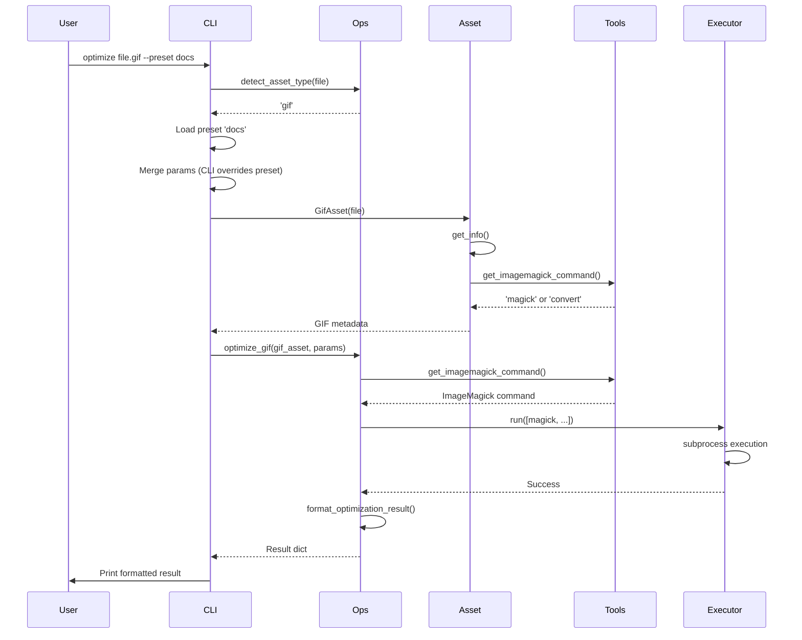

# Development Guide

## Philosophy

AssetGuy is a **policy + orchestration layer** for asset optimization. It does not reinvent low-level tools but instead:

- Integrates best-in-class existing tools (ImageMagick, FFmpeg, Pillow)
- Applies opinionated but overridable defaults
- Standardizes workflows developers repeatedly struggle with
- Provides clarity over raw power

> Think "Prettier / ESLint for assets", not "FFmpeg replacement".

### Core Principles

1. **Do NOT reinvent low-level tools** - Orchestrate and standardize existing, battle-tested tools
2. **Flexible but guided** - Good defaults and presets, with override capability
3. **Assets, not formats** - Treat static images, animated images, and videos as assets in a pipeline
4. **Clarity over completeness** - Prefer defaults over configuration, wrapping tools over reimplementing

## Architecture

### High-Level Flow



### Package Structure



### Data Flow: Optimize Command



## Module Responsibilities

### `cli.py`
- Command-line interface using Click
- Parameter parsing and validation
- Interactive vs non-interactive mode handling
- Output formatting (human-readable vs JSON)

### `operations/`
- **`inspect.py`**: Unified asset inspection across all types
- **`optimize.py`**: Core optimization logic for GIFs and images
- **`compare.py`**: Before/after comparison utilities

### `assets/`
- **`base.py`**: Base `Asset` class with common functionality
- **`gif.py`**: `GifAsset` class for GIF-specific operations
- **`image.py`**: `ImageAsset` class for static image operations

### `tools/`
- **`detector.py`**: Detects availability of external tools (ImageMagick, FFmpeg)
- **`executor.py`**: Safe subprocess execution wrapper

### `config/`
- **`manager.py`**: Unified configuration management (`~/.assetguy/config.yaml`)
- **`presets.py`**: Preset definitions (docs, web, marketing)

### `utils/`
- **`formatting.py`**: File size and time formatting utilities
- **`paths.py`**: Path handling (quote stripping, expansion)

## Tool Dependencies

AssetGuy relies on external tools and gracefully handles their absence:

| Tool | Purpose | Required For | Detection |
|------|---------|--------------|-----------|
| ImageMagick | GIF manipulation, inspection | GIF operations | `tools/detector.py` |
| Pillow | Image processing | Image operations | Python package |
| FFmpeg | Video processing | Video operations (v0.2) | `tools/detector.py` |

## Preset System

Presets are experience-backed policies, not magic. They define:

- Target dimensions (width)
- FPS caps (for GIFs)
- Color limits (for GIFs)
- Quality settings

**Priority order:**
1. CLI flags (highest)
2. Preset values
3. Interactive prompts (if interactive mode)
4. Defaults (lowest)

## Adding New Features

### Adding a New Asset Type

1. Create asset class in `assets/` (e.g., `assets/video.py`)
2. Extend `operations/inspect.py` to detect and handle new type
3. Add optimization logic in `operations/optimize.py` if needed
4. Update `cli.py` to support new type in commands

### Adding a New Operation

1. Add function to appropriate `operations/` module
2. Export from `operations/__init__.py`
3. Add CLI command in `cli.py`
4. Update tests

### Adding a New Preset

1. Add preset definition to `config/presets.py`
2. Document in README.md
3. Test with various asset types

## Testing

Test files are located in `test-files/` (excluded from git).

**Test coverage:**
- GIF optimization with various parameters
- Image optimization with presets
- Format detection and inspection
- Comparison operations
- JSON output format

## Development Workflow

1. **Setup:**
   ```bash
   pip install -e .
   ```

2. **Run tests:**
   ```bash
   python -m assetguy.cli inspect test-files/demo.gif
   python -m assetguy.cli optimize test-files/demo.gif --preset docs
   ```

3. **Check tool availability:**
   ```bash
   python -c "from assetguy.tools.detector import get_imagemagick_command; print(get_imagemagick_command())"
   ```

## Design Guardrails

When adding features, follow these principles:

- ✅ Prefer clarity over completeness
- ✅ Prefer defaults over configuration
- ✅ Prefer wrapping tools over reimplementing
- ✅ Avoid plugin systems until proven necessary
- ✅ Avoid "AI magic" or opaque heuristics
- ❌ Don't reimplement codecs or encoders
- ❌ Don't expose excessive low-level flags
- ❌ Don't hide what the tool is doing

## Roadmap

**v0.1** (Current)
- ✅ Package structure
- ✅ GIF optimization
- ✅ Image optimization
- ✅ Presets
- ✅ Interactive CLI

**v0.2** (Next)
- GIF → WebP conversion
- Video → GIF/WebP
- Duration trimming
- FFmpeg integration

**v0.3** (Future)
- Static image compression (pngquant, mozjpeg)
- Batch processing
- CI templates / GitHub Actions

## Contributing

1. Follow the architecture patterns above
2. Keep operations modular and testable
3. Maintain backward compatibility
4. Update documentation for user-facing changes
5. Test with real assets from `test-files/`
